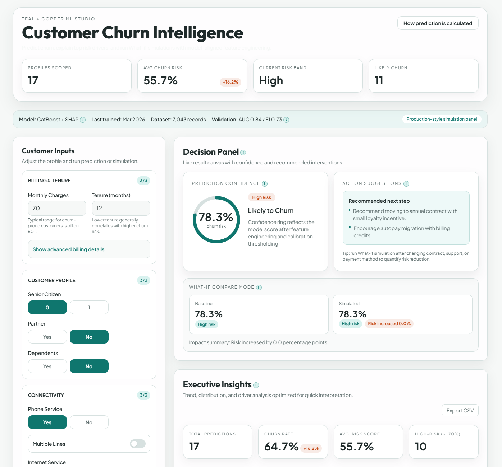
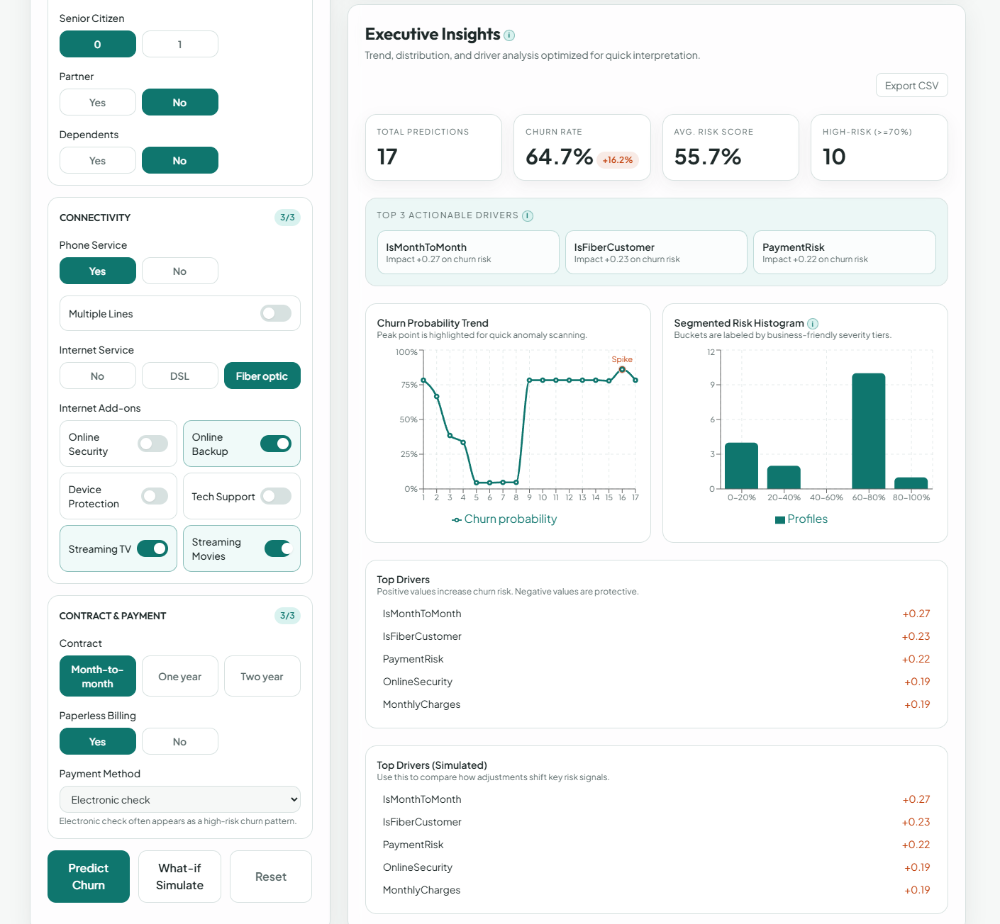

# Customer Churn Predictor (Explainable + What-If Dashboard)

Production-style churn prediction application with:

- FastAPI backend for prediction and explanation
- React + TypeScript frontend dashboard
- CatBoost inference + SHAP feature attributions
- What-if simulation and comparison workflow

## Stack

- Frontend: React, TypeScript, Vite, Tailwind CSS, Recharts
- Backend: FastAPI, Pydantic, Uvicorn, python-dotenv
- ML runtime: CatBoost, pandas, numpy, SHAP
- Data: Telco Customer Churn dataset

## Dataset Expansion (Without Changing Current Model)

You can broaden the project by tracking multiple churn datasets in parallel while keeping the current production model unchanged.

- Dataset catalog: `data/dataset_catalog.json`
- External dataset drop folder: `data/external/`
- Inventory report script: `model/training/build_dataset_report.py`
- Generated report: `data/dataset_report.md`

### How to add more datasets

1. Put new CSV files inside `data/external/`.
2. Add entries to `data/dataset_catalog.json` with target column and positive label.
3. Run:

```bash
python model/training/build_dataset_report.py
```

4. Review `data/dataset_report.md` for availability, row counts, and churn rate.

This lets you expand into domains like banking or SaaS before deciding whether to train a challenger model.

## Reproducible Pipeline Bundle (Preprocessing + Model)

For strict reproducibility, package preprocessing artifacts and model version together as one immutable bundle.

Build a pipeline bundle:

```bash
python model/preprocessing/pipeline_bundle.py --version v2
```

This creates a zip in `model/artifacts/bundles/` containing:

- `model/model.cbm`
- `preprocessing/feature_list.json`
- `preprocessing/cat_columns.json`
- `preprocessing/preprocessing_spec.json`
- `manifest.json` (artifact format + SHA256 checksums)

Register the bundle as a candidate model artifact:

```bash
curl -X POST "http://127.0.0.1:8000/api/v1/models/register" \
  -H "Authorization: Bearer <admin_token>" \
  -H "Content-Type: application/json" \
  -d "{\"version\":\"v2\",\"metrics\":{\"roc_auc\":0.87},\"artifact_path\":\"model/artifacts/bundles/churn_pipeline_v2_YYYYMMDDTHHMMSSZ.zip\"}"
```

When promoted, the backend accepts the bundle URI directly and verifies manifest checksums before loading the model.

## Current Capabilities

- Predict churn probability with configurable threshold
- Explain predictions with top SHAP drivers
- Run what-if simulations and compare before/after outcomes
- Visualize confidence, trend proxy, and risk distribution
- Export chart data to CSV
- Persist form values in localStorage for continuity

## Implemented Improvements (Full Record)

This section tracks all non-model-architecture improvements completed in this project session.

### 1) Backend reliability and API hardening

- Expanded backend dependencies in `backend/requirements.txt` to include required runtime libs.
- Replaced hardcoded model path logic with portable `Path`-based loading in `backend/model_loader.py`.
- Added safer load-time error handling for model/SHAP artifacts.
- Strengthened request validation in `backend/schema.py` using strict enum-like literals and numeric constraints.
- Updated `backend/app.py` with:
  - env loading (`python-dotenv`)
  - env-driven CORS origins
  - improved exception handling and HTTP error responses
  - threshold query parameter support for `/predict`
  - robust `/explain` response serialization
- Added backend environment file support with allowed origins configuration.

### 2) Backend feature parity fix (critical bug)

- Corrected inference feature engineering in `backend/feature_engineering.py` to match training preprocessing for:
  - `TotalServices`
  - `TechIssueRisk`

This fixed a real training-vs-inference mismatch that could skew outputs.

### 3) Frontend API and typing improvements

- Added frontend env-based API URL configuration in `client/.env`.
- Updated `client/src/services/api.ts` to:
  - use `VITE_API_URL`
  - use stronger request typing
  - return clearer API error details
- Fixed a Vite-breaking syntax issue in `client/src/services/api.ts` (stray brace).
- Tightened form state typing in `client/src/types/formState.ts` with explicit unions.

### 4) Form UX, validation, and accessibility

- Rebuilt `client/src/components/ChurnForm.tsx` with:
  - progressive disclosure sections
  - completion indicators
  - chip-style controls for categorical choices
  - stronger client-side validation and reset behavior
  - improved keyboard/accessibility semantics
  - sticky mobile action bar

### 5) Dashboard and insights redesign

- Reworked `client/src/pages/Dashboard.tsx` with:
  - sticky form + analytics layout
  - KPI/stat ribbon and model meta strip
  - what-if comparison panel (delta + changed fields)
  - prediction method explainer modal
  - improved responsive behavior

### 6) Prediction card redesign

- Rebuilt `client/src/components/PredictionCard.tsx` with:
  - confidence ring visualization
  - risk tier messaging
  - actionable hints
  - loading skeleton states

### 7) Chart storytelling upgrade

- Upgraded `client/src/components/Charts.tsx` with:
  - clearer narrative framing
  - spike annotation treatment
  - segmented risk distribution view
  - mobile-friendly card/swipe behavior
  - CSV export support retained

### 8) Shared UI system refresh

- Restyled shared primitives:
  - `client/src/components/ui/Section.tsx`
  - `client/src/components/ui/KPI.tsx`
  - `client/src/components/ui/Toggle.tsx`
- Introduced unified visual language in `client/src/index.css`:
  - Teal + Copper palette
  - global design tokens
  - typography and atmospheric background treatment
  - motion/animation utilities

### 9) Explainability microcopy tooltips

- Added reusable info icon tooltip component:
  - `client/src/components/ui/InfoTip.tsx`
- Integrated contextual i-tooltips for technical labels in dashboard/cards/charts.

### 10) Repo cleanup

- Removed unused legacy files:
  - `app/main.py`
  - `app/utils.py`

### 11) Runtime sanity checks completed

- Verified endpoint behavior for:
  - `POST /predict`
  - `POST /explain`
  - threshold query behavior
  - invalid payload validation (`422`)
- Verified frontend production build succeeds (`npm run build`).

## Project Structure

- Backend API: `backend/app.py`
- Feature engineering at inference: `backend/feature_engineering.py`
- Model loading: `backend/model_loader.py`
- Frontend app shell: `client/src/pages/Dashboard.tsx`
- API client: `client/src/services/api.ts`

## Local Setup

### Prerequisites

- Node.js 18+
- Python 3.9+

### 1) Backend

```bash
cd backend
python -m venv .venv
# Windows
.\.venv\Scripts\activate
pip install -r requirements.txt
python -m uvicorn app:app --host 127.0.0.1 --port 8000 --reload
```

Database migration (PostgreSQL with Alembic):

```bash
cd backend
alembic -c db/alembic.ini upgrade head
```

Alternative from repository root:

```bash
python -m uvicorn app:app --app-dir backend --host 127.0.0.1 --port 8000 --reload
```

### 2) Frontend

```bash
cd client
npm install
npm run dev
```

If port `5173` is occupied, Vite may auto-switch to another port (for example `5174`).

### 3) Build frontend

```bash
cd client
npm run build
```

### 4) Run with Docker Compose

```bash
docker compose up --build
```

Services:

- Frontend: `http://localhost:5173`
- Backend API: `http://localhost:8000`

To stop:

```bash
docker compose down
```

## API Endpoints

- Auth:
  - `POST /api/v1/auth/login`
  - `POST /api/v1/auth/refresh`
- Predictions:
  - `POST /api/v1/predictions/predict`
  - `POST /api/v1/predictions/explain`
  - `POST /api/v1/predictions/recommend`
  - `POST /api/v1/predictions/feedback`
  - `POST /api/v1/predictions/outcome`
- Monitoring:
  - `GET /api/v1/system/monitoring`
  - `GET /api/v1/system/canary`
- Model lifecycle:
  - `GET /api/v1/models`
  - `POST /api/v1/models/register`
  - `POST /api/v1/models/shadow`
  - `POST /api/v1/models/promote`
  - `POST /api/v1/models/rollback`
- Jobs:
  - `POST /api/v1/jobs/batch-score`
  - `GET /api/v1/jobs/{job_id}/download`
- OpenAPI docs: `http://127.0.0.1:8000/docs`

Default demo users:

- `admin` / `admin123`
- `analyst` / `analyst123`
- `viewer` / `viewer123`

## Infrastructure Configuration

The backend now supports a pluggable infrastructure stack:

- `database_backend=sqlite|postgres`
- `postgres_url=postgresql+psycopg://...`
- `redis_enabled=true|false`
- `redis_url=redis://...`
- `object_storage_provider=none|local|s3|azure`

Object storage settings:

- `object_storage_bucket`
- `object_storage_prefix`
- `object_storage_local_path`
- `azure_blob_account_url`
- `azure_blob_credential`

When `object_storage_provider` is enabled:

- model loader can resolve `s3://` and `az://` model artifact URIs
- batch CSV uploads and generated report CSVs can be persisted in object storage

## Deploy (Vercel + Render)

Recommended split:

- Frontend: Vercel (root directory: `client`)
- Backend: Render Web Service (root directory: `backend`)

### Backend on Render

Build command:

```bash
pip install -r requirements.txt
```

Start command:

```bash
uvicorn app:app --host 0.0.0.0 --port $PORT
```

Set these Render environment variables at minimum:

- `SECRET_KEY`
- `ALLOWED_ORIGINS` (comma-separated or JSON list)
- `DATABASE_BACKEND` (`sqlite` or `postgres`)
- `POSTGRES_URL` (if using Postgres)
- `REDIS_ENABLED`, `REDIS_URL` (if using Redis)
- `OBJECT_STORAGE_PROVIDER` and related storage vars (if using object storage)

Example `ALLOWED_ORIGINS`:

```text
https://your-frontend.vercel.app
```

or

```text
["https://your-frontend.vercel.app"]
```

Health endpoints for Render checks:

- `/api/v1/system/health`
- `/api/v1/system/ready`

### Frontend on Vercel

Set project root to `client` and add:

- `VITE_API_URL=https://your-backend.onrender.com`

The frontend calls API routes via `${VITE_API_URL}/api/v1/...`.

If `VITE_API_URL` is not set in production, the app falls back to same-origin (`""`).

## Continuous Deployment (Approved Model/Service)

The repository includes a production CD workflow:

- Workflow file: `.github/workflows/cd.yml`
- Trigger 1: after CI succeeds on `main`
- Trigger 2: manual run (`workflow_dispatch`) with optional model promotion

Deployment is gated by a GitHub environment named `production`.
Set required reviewers in the `production` environment to enforce approval before deployment proceeds.

CD behavior:

- Waits for production approval gate.
- Optionally promotes an approved candidate model (`/api/v1/models/promote`) when `promote_candidate_model_id` is provided in manual runs.
- Triggers backend deployment via Render Deploy Hook.
- Verifies backend readiness (`/api/v1/system/ready`) when a healthcheck URL secret is configured.
- Triggers frontend deployment via Vercel Deploy Hook.

Required GitHub secrets:

- `RENDER_DEPLOY_HOOK_URL`
- `VERCEL_DEPLOY_HOOK_URL`
- `BACKEND_HEALTHCHECK_URL` (optional but recommended, for example `https://your-backend.onrender.com/api/v1/system/ready`)

Required only for model auto-promotion during manual CD runs:

- `BACKEND_API_URL` (for example `https://your-backend.onrender.com`)
- `BACKEND_ADMIN_TOKEN` (admin JWT used for `/api/v1/models/promote`)

Manual CD run examples:

- Deploy service only: run CD workflow with defaults.
- Deploy and promote approved model: provide `promote_candidate_model_id` in the workflow input.

## Screenshots

Old screenshots were removed and replaced with renamed, descriptive assets.



